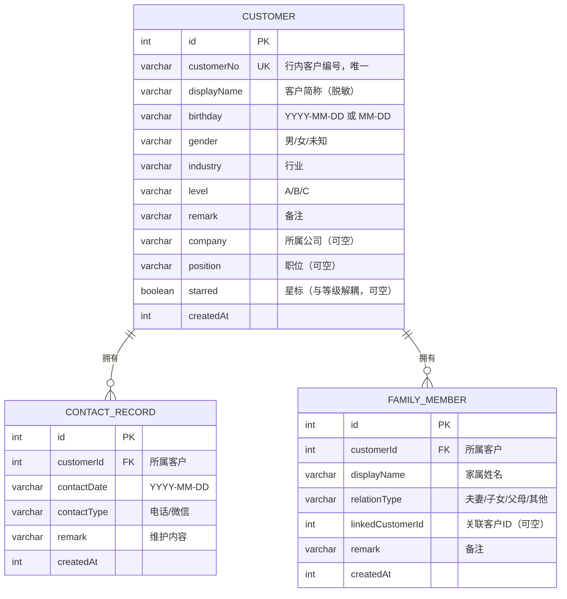

# 心桥（客户生日关怀助手）PRD 产品文档

> 文档用途：产品定义与研发依据；可供其他智能体平台基于本文档完成复刻（可整篇复制）。
> 文档版本：V4.0（全量版：依据当前代码实现逐项核对，含全部已上线功能与“设计考量”说明）
> 整理日期：2026-08-05
> 产品名称：心桥｜品牌口号：心的桥梁
> 正式访问地址：https://xinqiao.ninkoro.com｜版权标识：Powered by Ninkoro.com

---

## 1. 文档说明

### 1.1 文档目的

本文档完整定义“心桥（客户生日关怀助手）”的产品定位、用户、功能需求、业务规则、数据模型、技术方案与验收标准，作为产品研发、测试、上线与后续迭代的统一依据；同时可供其他智能体平台据此复刻同类产品。

### 1.2 版本历史

| 版本 | 日期 | 说明 |
| --- | --- | --- |
| V1.0 | 2026-08-04 | 依据初版 PRD 整理 |
| V2.0 | 2026-08-05 | 依据代码实现补齐家属关系、导入撤销、记录编辑、公司/职位、PWA 等 |
| V3.0 | 2026-08-05 | 完整详尽版：增加需求编号、用户故事、逐条验收标准、边界场景、部署与复刻指南细化 |
| V4.0 | 2026-08-05 | 全量版：补录星标、生日衍生标签、家属生日倒计时与备注跟随、导出提醒、轻量化等已上线功能，并为每个模块补充“设计考量” |

### 1.3 读者对象

产品经理、研发工程师、测试工程师、设计人员、客户经理代表，以及其他智能体平台（复刻用途）。

---

## 2. 产品概述

### 2.1 产品定位

**心桥**是一款面向银行客户经理的轻量化客户关系维护工具。以“客户编号 + 生日提醒 + 祝福辅助 + 维护记录 + 家属关系”为主线，帮助客户经理每天用 30 秒至 2 分钟完成重点客户的生日关怀，避免遗漏、沉淀关系资产，为银行公私联动与客户精准画像提供基础数据。

| 项目 | 内容 |
| --- | --- |
| 产品形态 | 轻量化 Web 应用（PWA，可安装到桌面/主屏） |
| 目标用户 | 银行客户经理（个人使用） |
| 一句话介绍 | 一个通过客户编号管理、生日提醒、祝福辅助和维护记录，提升重点客户关系维护效率的工具 |
| 品牌口号 | 心的桥梁 |
| 数据边界 | 仅保存客户编号、简称、生日、性别、行业、等级、备注、公司/职位、维护记录与家属关系；不保存身份证号、银行账号、完整姓名、交易信息 |
| 运行模式 | 本地优先：数据存储于浏览器 IndexedDB，无后端、无埋点、无需服务器 |

### 2.2 核心价值

1. **减少遗漏**：提前 7 天提醒 + 当天提醒（暂缓上线），客户经理不再依赖人工记忆；
2. **降低成本**：零服务器、零收费数据库，个人可独立使用；
3. **提升质量**：离线个性化祝福 + 维护记录沉淀，形成长期客户关系资产；
4. **隐私友好**：敏感字段一律不入库，数据只存本机。

### 2.3 产品目标

实现完整业务闭环：

```
客户信息管理 → 生日自动识别 → 提前提醒 → 生日当天提醒（暂缓上线）→ 完成客户维护 → 沉淀维护记录
```

---

## 3. 产品背景与问题分析

### 3.1 背景

- 银行客户经理日常维护大量客户，客户关系维护节点包括生日、节假日、企业周年、授信节点、合作纪念日等，其中生日关怀属低成本、高情感价值的触达方式；
- 现状依赖 Excel 记录、手机备忘录、人工记忆，存在客户多易遗漏、无法提前规划、缺少维护记录、难以形成长期客户关系资产等问题；
- 银行对客户数据合规要求高，客户姓名、账号、交易信息等敏感数据不可随意采集与留存。

### 3.2 问题与对策

| 现状痛点 | 产品对策 |
| --- | --- |
| 客户多，生日易遗漏 | 提前 7 天 + 当天（A 类三次）双提醒 |
| 无法提前规划 | 首页“未来 7 天”列表 + 距离天数标签 |
| 缺少维护记录 | 维护记录模块，按客户沉淀历史 |
| 祝福生硬重复 | 离线规则引擎按等级/行业/备注个性化随机生成 |
| 敏感数据合规风险 | 仅存客户编号与脱敏简称，全程本地存储 |

---

## 4. 用户画像与使用场景

### 4.1 用户画像

| 维度 | 描述 |
| --- | --- |
| 用户 | 银行客户经理（个人使用，非多人协作） |
| 设备 | 办公电脑（Chrome/Edge）、手机（iOS Safari / Android Chrome） |
| 场景 | 每天上午打开应用查看今日与未来 7 天生日客户 |
| 操作时长 | 每日 30 秒～2 分钟 |
| 诉求 | 快速知道“今天该维护谁”，获取祝福参考，记录结果 |

### 4.2 典型用户故事

| 编号 | 作为… | 我想要… | 以便… |
| --- | --- | --- | --- |
| US-01 | 客户经理 | 一打开应用就看到今日生日客户 | 第一时间安排关怀 |
| US-02 | 客户经理 | 提前看到未来 7 天生日客户 | 提前规划电话/上门 |
| US-03 | 客户经理 | 把原有 Excel 客户批量导入 | 免去逐条录入 |
| US-04 | 客户经理 | 获得符合客户行业与备注的祝福语 | 发得自然不敷衍 |
| US-05 | 客户经理 | 记录每次关怀的方式与内容 | 追溯与客户的关系历史 |
| US-06 | 客户经理 | 登记客户家属关系 | 公私联动、关键人识别 |
| US-07 | 客户经理 | 误导入时可回退 | 避免数据被污染 |
| US-08 | 客户经理 | 断网也能查看与记录 | 出差/信号差时正常使用 |

---

## 5. 设计原则

1. **极简操作**：不增加客户经理工作，而是减少遗漏；每日操作控制在 30 秒～2 分钟；
2. **隐私安全**：不采集、不保存敏感信息；本地存储优先；
3. **零成本**：纯前端 + 本地数据库，不依赖商业服务器与收费数据库；
4. **离线可用**：首次访问后断网可查看与记录；
5. **可回退**：破坏性操作有撤销（导入）或三次确认（清空）保护；
6. **橙白视觉**：主色橙（#C2410C）+ 米白背景，深色模式自动适配。

### 5.1 功能设计理念总纲

心桥的每一个功能都对应一个具体的业务痛点，遵循“**先解决有没有，再解决好不好**”的原则：

| 设计取向 | 背后的考量 |
| --- | --- |
| 一打开就看到“今天该维护谁” | 客户经理一天的工作从“查名单”开始，首页即答案，减少决策成本 |
| 客户编号 + 脱敏简称 | 既要对应行内客户，又不采集敏感姓名，满足银行合规 |
| 生日只做“月日”也可录入 | 大量存量客户只知月日不知年份，严格要年份会把数据挡在门外 |
| 生日智能解析多格式 | 现实中的 Excel 五花八门（斜杠、点号、中文、Excel 序列号），严格校验会误伤正常数据 |
| 状态由“当天维护记录”派生 | 不落库就不会跨年过期，也不用年底“清零” |
| 本地规则生成祝福 | 客户信息不出本机（隐私）+ 零成本 + 离线可用，且可稳定复现 |
| 家属关系双向同步 | 一人维护、双方可见，避免“我只知道他，他不知道我”的信息孤岛 |
| 备注跟随关联人本人 | 关于“他”的信息就落在“他”身上，如“喜欢雪茄”应属于张先生，而不是串到子女张小姐名下，避免送礼/话术张冠李戴 |
| 生日标签（年龄/属相/本命年/星座） | 精准画像：属相用于本命年祝福与送礼（红绳、转运物），星座用于聊天话题，年龄用于称呼分寸与关怀深度 |
| 星标与 ABC 等级解耦 | 等级是“价值”维度，星标是“关注”维度——C 类客户也可能很特殊，值得被单独记住 |
| 完成关怀后提醒导出 | 本地存储的天敌是“清缓存/换机”，把备份提醒嵌入工作流末端，养成习惯且不打扰 |
| 导出跳过空单元格 | 数据稀疏时文件显著变小，银行网络与存储环境下更友好 |

---

## 6. 功能需求总览

| 模块 | 需求编号 | 功能 | 状态 |
| --- | --- | --- | --- |
| 首页工作台 | FR-01～FR-05 | 顶部统计、今日生日卡片、未来 7 天列表、完成维护、卡片跳转详情 | 已实现 |
| 客户管理 | FR-06～FR-12 | 列表、搜索、组合筛选、新增、编辑、删除 | 已实现 |
| 客户详情 | FR-13～FR-17 | 信息卡、快捷操作、历史维护记录、家属关系、编辑入口 | 已实现 |
| Excel 导入 | FR-18～FR-24 | 模板下载、智能解析、逐行校验、重复处理、错误报告、撤销 | 已实现 |
| 数据导出 | FR-25 | 导出客户/维护/家属三表 .xlsx | 已实现 |
| 生日提醒 | FR-26～FR-30 | 提前 7 天、当天 A 类三次（暂缓上线）、状态流转、开关（暂缓）、卡片跳详情 | 提前 7 天已实现；当天提醒与提醒开关暂缓上线 |
| 祝福助手 | FR-31～FR-34 | 离线随机生成、换一换、复制、字数与禁用词约束 | 已实现 |
| 维护记录 | FR-35～FR-38 | 新增、二次编辑、多入口、客户维度沉淀 | 已实现 |
| 家属关系 | FR-39～FR-45 | 关系类型、搜索关联、双向同步、编辑删除、历史补齐 | 已实现 |
| 家属关系增强 | FR-56～FR-57 | 关联人生日倒计时、备注跟随关联人本人 | 已实现 |
| 设置 | FR-46～FR-50 | 模板下载、导入、导出、撤销导入、清空（三次确认）、提醒开关、隐私说明 | 已实现 |
| 星标与画像 | FR-54～FR-55 | 星标开关/筛选/排序、年龄/属相/本命年/星座标签 | 已实现 |
| 数据安全与轻量化 | FR-58～FR-59 | 完成关怀后导出提醒（每日一次）、模板与导出轻量化 | 已实现 |
| 平台能力 | FR-51～FR-53 | PWA 离线、安装到桌面/主屏、iOS 添加到主屏幕 | 已实现 |

---

## 7. 详细功能需求

> 每条需求均给出用户故事、功能说明、验收标准与边界/异常处理。验收标准同时作为测试用例编写依据。

### 7.1 首页工作台

#### FR-01 顶部统计

- 用户故事：作为客户经理，我希望打开应用立即看到当日工作量。
- 说明：页面顶部三张统计卡，显示“今日生日人数”“未来 7 天人数（不含今天）”“A 类客户人数”。
- 验收标准：
  1. 今日生日统计仅统计生日月日与今天相同（含无年份生日）的客户；
  2. 未来 7 天统计距离 1～7 天的客户，**不含今天**；
  3. A 类客户统计等级为 A 的客户总数；
  4. 数据变化（增删改/导入）后统计自动刷新。

#### FR-02 今日生日卡片

- 说明：卡片展示客户简称、客户编号、行业、备注；操作按钮“生成祝福”“完成维护”；当天已有维护记录时卡片显示“今日已维护”。
- 验收标准：
  1. 点击“生成祝福”打开祝福助手；
  2. 点击“完成维护”打开维护记录表单（方式/内容）；
  3. 完成后卡片标记“今日已维护”，且与客户列表/提醒页状态一致；
  4. 有多个今日生日客户时逐卡展示，可滚动查看。

#### FR-03 未来 7 天生日列表

- 说明：按距离天数 1～7 排序展示客户（日期、简称、等级徽标、剩余天数）；整卡可点击。
- 验收标准：
  1. 仅展示距离 1～7 天的客户（不含今天）；
  2. 排序由近及远；
  3. 点击卡片进入该客户详情页。

#### FR-04 今日生日卡片跳转详情

- 说明：今日生日卡片支持点击进入客户详情。
- 验收标准：卡片区域点击后路由到对应客户详情，数据与客户管理页一致。

#### FR-05 空状态

- 说明：无今日生日/无未来 7 天客户时展示友好空状态文案。
- 验收标准：无数据时不展示空白页，给出引导文案（如“今天没有客户生日”）。

**设计考量**：客户经理打开应用的第一个动作是“今天该维护谁”，首页直接给出三个答案——今日生日（今天必须做什么）、未来 7 天（近期该准备什么，如订花、备礼、约时间）、A 类客户（重点在哪）。卡片自带“生成祝福 / 完成维护”，让“看名单 → 发祝福 → 记结果”在一条路径上完成，而不是在多页面间跳转。

### 7.2 客户管理

#### FR-06 客户列表

- 说明：列表字段含客户简称（+等级徽标）、客户编号、性别、行业、生日、距离生日标签、维护状态（待维护/已完成）、行操作。
- 验收标准：
  1. 维护状态由“当天是否存在维护记录”派生；
  2. 行内提供查看详情、编辑、删除入口；
  3. 列表按生日/创建时间排序稳定。

#### FR-07 搜索

- 说明：支持按客户编号、客户简称实时过滤。
- 验收标准：
  1. 输入即过滤，大小写不敏感；
  2. 编号与简称任一命中即展示；
  3. 无结果时展示空状态。

#### FR-08 组合筛选

- 说明：支持等级（全部/A/B/C）、时间（全部/今日生日/未来 7 天/本月生日）、行业（8 类+全部）组合筛选。
- 验收标准：
  1. 三个维度可任意组合；
  2. 时间筛选与首页口径一致（未来 7 天不含今天；本月生日按当前月）；
  3. 筛选与搜索可同时生效。

#### FR-09 新增客户

- 说明：表单字段如下表；客户编号必填且行内唯一。

| 字段 | 必填 | 示例 | 校验 |
| --- | --- | --- | --- |
| 客户编号 | 是 | C20260001 | 非空、唯一（重复提示） |
| 客户简称 | 是 | 刘先生 | 非空 |
| 生日 | 是 | 1990-08-05 / 08-05 / 1990年8月5日 | 智能解析并统一存储为 YYYY-MM-DD 或 MM-DD；非法日期拒绝 |
| 性别 | 否 | 男/女/未知 | 枚举 |
| 行业 | 否 | 制造业 | 枚举 8 类 |
| 客户等级 | 否 | A 类重点客户 | 枚举 A/B/C |
| 备注 | 否 | 喜欢茶文化 | 自由文本 |
| 所属公司 | 否 | 华兴制造集团 | 自由文本，选填 |
| 职位 | 否 | 总经理 | 自由文本，选填 |

- 验收标准：
  1. 必填缺失或编号重复时给出行内错误提示，禁止提交；
  2. 保存后立即出现在客户列表，并参与统计与提醒计算。

#### FR-10 编辑客户

- 说明：客户列表行编辑图标或详情页“编辑客户”均可打开编辑弹窗；弹窗内可同时维护家属关系。
- 验收标准：
  1. 预填原值，修改后即时生效并同步各页面；
  2. 编号变更时仍保持唯一性校验；
  3. 编辑弹窗内家属关系操作与详情页模块行为一致。

#### FR-11 删除客户

- 说明：删除需确认；删除后级联删除该客户维护记录与家属关系（含对方反向关系）。
- 验收标准：
  1. 弹窗二次确认；
  2. 删除后该客户不再出现在列表、统计、提醒、祝福中；
  3. 其维护记录一并删除；家属关联在对方详情页同步移除。

#### FR-12 状态派生

- 说明：客户“待维护/已完成”由当天维护记录派生，不落库。
- 验收标准：删除当天维护记录后状态自动回到“待维护”，无需人工修改。

**设计考量**：客户编号 + 脱敏简称是为了在“能对应行内客户”和“不采集敏感姓名”之间取平衡，符合银行数据合规底线。搜索与组合筛选解决“客户多了找不到”的问题——例如要准备“本月过生日的 A 类制造业客户”的拜访名单，三个维度组合一次成型。编辑弹窗内直接维护家属关系，是为了减少“改资料还要去另一个页面”的打断。

### 7.3 客户详情页

#### FR-13 基本信息卡与快捷操作

- 说明：展示编号、性别、行业、生日、距离生日天数、备注、公司、职位；快捷操作“编辑客户 / 生成祝福 / 完成维护”。
- 验收标准：信息完整可读；三个快捷操作均可用；距离生日天数与列表一致。

#### FR-14 历史维护记录模块

- 说明：按日期倒序展示该客户全部维护记录，每条含维护日期、方式、内容，支持二次编辑。
- 验收标准：
  1. 与提醒页维护记录数据一致；
  2. 编辑后两处同步更新；
  3. 记录较多时可滚动，无数据时显示空状态。

#### FR-15 家属关系模块（详情页）

- 说明：展示关系类型徽标（夫妻/子女/父母/其他）+ 姓名；支持新增、编辑、删除；关联客户姓名可点击跳转对方详情。
- 验收标准：
  1. 关系类型四选一；
  2. 点击关联客户姓名跳转到对方详情页；
  3. 删除需确认，删除后双方同步。

#### FR-16 家属关系搜索添加

- 说明：新增家属时支持按客户编号或客户姓名搜索系统内已有客户并选择添加；也可仅登记姓名与备注（不关联）。
- 验收标准：
  1. 搜索框输入编号或姓名实时过滤；
  2. 选中关联客户后自动采用其简称作为家属姓名；
  3. 无匹配时允许仅登记姓名。

#### FR-17 客户详情编辑入口统一

- 说明：首页今日卡片、客户列表行、提醒时间线均可点击进入客户详情，并在详情内维护关联关系。
- 验收标准：三个入口均可到达详情页，且详情页内编辑/家属/记录功能一致可用。

**设计考量**：详情页是“一个人的档案袋”——基础信息、历史维护记录、家属关系集中呈现。历史维护记录是为了可追溯（上次聊了什么、送过什么、客户反馈如何），避免重复打扰或张冠李戴；家属关系则服务于公私联动（企业主的配偶/子女可能是实际控制人或关键决策影响者）。生日倒计时与标签（见 7.12）让客户经理在打开档案的瞬间就知道“该准备什么”。

### 7.4 Excel 批量导入

#### FR-18 模板下载

- 说明：提供标准模板《客户生日关怀助手_导入模板.xlsx》，字段：客户编号、客户简称、生日、性别、行业、客户等级、备注。
- 验收标准：模板可下载、字段与导入解析一致、含示例行。

#### FR-19 生日智能解析

- 说明：生日字段不做严格格式校验，采用智能解析并统一存储；支持格式见第 8 节。
- 验收标准：
  1. 全部支持格式均能导入且存储统一（YYYY-MM-DD 或 MM-DD）；
  2. Excel 日期对象/日期序列号自动转换；
  3. 无法解析或日期不存在（如 2026-02-30）给出明确行级错误。

#### FR-20 逐行校验与错误报告

- 说明：上传后逐行校验，展示可导入/失败/重复数量、逐行错误明细；可下载错误报告。
- 验收标准：
  1. 错误提示含行号与原因（编号为空、简称为空、生日为空、格式无法识别、日期不存在、等级非法等）；
  2. 错误报告可下载留档；
  3. 校验结果页支持返回修改或直接导入有效行。

#### FR-21 重复客户处理

- 说明：按客户编号判断重复，提供“覆盖（更新原记录）/ 跳过 / 取消”三种处理。
- 验收标准：
  1. 覆盖后原记录字段被更新；
  2. 跳过则不写入该行；
  3. 取消则中止整个导入。

#### FR-22 导入结果

- 说明：导入完成展示成功/失败条数与错误报告入口。
- 验收标准：成功数、失败数与实际落库/失败行一致。

#### FR-23 导入撤销

- 说明：导入结果页提供“撤销导入”，设置页提供“撤销上次导入”；撤销后删除新增客户及其维护记录、还原被覆盖客户。
- 验收标准：
  1. 撤销后新增客户及其维护记录被删除；
  2. 被覆盖客户恢复导入前快照；
  3. 再次导入会覆盖上一次会话，撤销入口状态正确；
  4. 无可撤销会话时入口不显示。

#### FR-24 导入提示文案

- 说明：上传页提示“生日支持：1990-08-05、08-05、1990年8月5日、8月5日，系统自动识别并转换”。
- 验收标准：提示在导入弹窗可见。

**设计考量**：客户经理的存量客户几乎都在 Excel 里，逐条录入是最大的迁移成本，所以批量导入是 P0。现实中的 Excel 日期格式五花八门（斜杠、点号、中文年月日、省略补零，甚至 Excel 日期序列号），若沿用严格校验会把大量正常数据误判为“格式错误”——因此导入采用“智能解析 + 统一存储”，解析不了的才报错，并给出可读的错误行号。重复处理与“撤销导入”解决的是“敢不敢用”的问题：误操作可回退，导入才无心理负担。

### 7.5 数据导出

#### FR-25 导出 .xlsx

- 说明：导出客户、维护记录、家属关系三个工作表。
- 验收标准：文件可下载打开；客户表列与导入模板一致；导出内容与当前数据一致。

**设计考量**：本地存储的天然代价是“换设备/清缓存即丢”，因此导出备份不是可选项而是安全网。导出按“客户 / 维护记录 / 家属关系”三张表完整还原数据结构，配合轻量化策略（跳过空单元格、紧凑列宽），让备份文件在银行网络与手机存储环境下更小、更快、更易二次导入（详见 7.13）。

### 7.6 生日提醒

#### FR-26 提前 7 天提醒

- 说明：生日距离当前日期 = 1～7 天时，在首页与提醒页展示“N 天后生日，请提前安排客户关怀”。
- 验收标准：距离计算正确（不含今天）；提醒卡片可点击进入客户详情。

#### FR-27 当天提醒（A 类客户）

- **状态：暂缓上线。** 原因：当前为纯网页应用，无系统通知权限，无法真正在 09:00 / 10:00 / 14:00 定时触达；待接入推送/通知能力后再恢复上线。功能说明与验收标准保留如下，供后续恢复时参考。
- 说明：生日当天 A 类客户按 09:00 / 10:00 / 14:00 三个时间点展示提醒。
- 验收标准：
  1. 三个时间点均展示且可操作；
  2. 仅 A 类客户出现；
  3. 应用内提醒（无系统推送）。

#### FR-28 提醒状态流转

- 说明：状态“待联系 → 已联系”，由当天是否存在维护记录派生。
- 验收标准：标记已联系后生成维护记录，状态变为已联系；删除记录后回到待联系。

#### FR-29 提醒开关

- **状态：暂缓上线。** 原因：随“当天提醒”一并暂缓，设置页“提醒设置”板块已从产品中移除；“提前 7 天提醒”保持默认开启。
- 说明：设置页可分别开关“提前 7 天提醒”“当天提醒”，本地持久化。
- 验收标准：关闭后对应区域不展示；开关状态刷新后保持。

#### FR-30 提醒卡片跳转

- 说明：提前 7 天提醒卡片可点击查看客户详情。
- 验收标准：点击进入详情，数据正确。

**设计考量**：提前 7 天是为了“来得及”——订花、备礼、约时间都需要提前量；当天 A 类客户 09:00 / 10:00 / 14:00 三个时间点，是因为重点客户通常一次触达不到位，多给三次机会提高触达率。提醒状态不落库、由“当天是否有维护记录”派生，是为了避免跨年状态过期（去年标过已联系，今年生日又要重新提醒）。提醒卡片可点击进入详情，让“看到提醒”到“了解客户”零跳转成本。

### 7.7 生日祝福助手

#### FR-31 离线随机生成

- 说明：不调用 AI 与网络，按“称呼句 + 等级信任句 + 行业祝愿句 + 备注个性化句 + 结尾句”逐层随机组合。
- 验收标准：多次生成结果有随机变化；本地离线可用。

#### FR-32 个性化要素

- 说明：按客户等级、行业、备注关键词（茶、授信、理财、对公/结算、私行、创业、连锁/门店、合作年限等 20 余组）生成。
- 验收标准：备注命中关键词时输出对应个性化句子；合作年限（如“合作5年以上”）可被提取入句。

#### FR-33 约束规则

- 说明：总长 30～80 字；禁用“尊敬的、在这个特殊日子、衷心祝愿”；微信聊天风格。
- 验收标准：
  1. 生成文本长度在 30～80 字之间，超长时按顺序丢弃备注句→行业句；
  2. 生成文本不含禁用词。

#### FR-34 换一换与复制

- 说明：支持“换一换”重新随机组合、“复制”到剪贴板。
- 验收标准：复制成功给出提示；换一换生成结果不同（随机组合）。

**设计考量**：祝福语是“高情感价值、低成本”的触达手段，但群发模板最伤感情。因此按等级（关系亲疏）选信任话术、按行业选事业祝愿、按备注关键词（茶、授信、理财、合作年限等）选个性化话题，让祝福“像人写的”。选用本地规则引擎而非调用 AI，是因为客户数据不出本机（隐私红线）+ 零成本 + 离线可用 + 结果可稳定复现；30～80 字与禁用词约束是为了微信聊天语境下不突兀。

### 7.8 维护记录

#### FR-35 新增维护记录

- 说明：字段：客户（自动）、日期（自动=当天）、方式（电话/微信）、内容；入口为今日卡片“完成维护”、提醒页“标记已联系”、详情页“完成维护”。
- 验收标准：任意入口生成记录后，各页面状态同步更新为已维护/已联系。

#### FR-36 二次编辑

- 说明：已保存记录可修改“方式”与“内容”，日期不可改。
- 验收标准：编辑后列表与详情实时同步。

#### FR-37 客户维度沉淀

- 说明：客户详情页“历史维护记录”展示该客户全部记录。
- 验收标准：记录按日期倒序，含日期与内容，可追溯。

#### FR-38 删除维护记录

- 说明：支持删除维护记录（含从提醒页/详情页删除）。
- 验收标准：删除后该客户状态回到待维护/待联系。

**设计考量**：维护记录把一次性的“问候”沉淀为长期关系资产（去年聊了什么、客户对什么感兴趣、送过什么），既是下一次关怀的素材，也是交接与述职的凭证。支持二次编辑是为了降低使用心理负担——记错了能改，客户经理才愿意记。新增入口统一挂在“完成维护 / 标记已联系”动作上，记录行为与关怀行为合一，不额外增加操作。

### 7.9 家属关系

#### FR-39 关系类型

- 说明：关系类型为夫妻 / 子女 / 父母 / 其他。
- 验收标准：四类可选，类型以徽标展示。

#### FR-40 关联已有客户

- 说明：新增时按客户编号或姓名搜索添加。
- 验收标准：见 FR-16。

#### FR-41 双向自动同步

- 说明：关联建立后，被添加客户详情页自动出现反向从属关系（夫妻↔夫妻、子女↔父母、父母↔子女、其他↔其他）。
- 验收标准：
  1. 建立关联后双方详情各出现一条记录；
  2. 编辑（改关系/改关联对象）后双方同步；
  3. 删除后双方同步移除。

#### FR-42 仅登记姓名

- 说明：支持不关联系统客户，仅登记家属姓名与备注。
- 验收标准：可保存、展示，不产生对方记录。

#### FR-43 历史数据补齐

- 说明：应用启动时自动为历史数据补齐反向从属关系（幂等）。
- 验收标准：升级后老数据自动补齐，重复运行不产生重复记录。

#### FR-44 家属删除确认

- 说明：删除家属需确认。
- 验收标准：确认后删除，取消不操作。

#### FR-45 关联跳转

- 说明：关联客户姓名可点击跳转对方详情页。
- 验收标准：跳转正确，可返回。

#### FR-56 关联人生日倒计时

- 说明：家属关系条目中，关联客户显示其生日倒计时（如“生日：6 天后”），新增/编辑弹窗与搜索结果同步展示。
- 验收标准：已关联客户条目展示生日倒计时；未关联（仅登记姓名）不展示；倒计时口径与全局一致。

#### FR-57 家属备注跟随关联人本人

- 说明：为关联客户填写/编辑的关系备注，写入该关联客户自己的备注信息；双方关系行不再复制备注，避免串到对方条目上。
- 验收标准：
  1. 在 A 的家属页为关联客户 B 填写“喜欢雪茄”，B 本人详情页备注显示该内容；
  2. B 的详情页中“子女/父母 A”条目显示的是 A 自己的备注，而不是“喜欢雪茄”；
  3. 新增时备注追加（不覆盖已有），编辑时以表单内容为准；
  4. 历史数据自动迁移（启动时幂等执行）。

**设计考量**：家属关系服务于两个目的——公私联动识别关键人（企业主的家属往往是实控人、接班人或影响决策的人），以及送礼/话术的画像补充（给客户挑礼品时，客户配偶的喜好同样是重要参考）。双向自动同步解决“信息孤岛”：张小姐的档案里登记了父亲张先生，张先生的档案里自动出现女儿张小姐。备注跟随关联人本人解决“张冠李戴”：你写的是“张先生喜欢雪茄”，这条信息就属于张先生，而不是被复制到“张先生的子女张小姐”名下，避免下次送礼把雪茄送错人。关联人生日倒计时让家属的生日也成为关怀节点，例如给客户夫人准备的生日问候同样提前可见。

### 7.10 设置

#### FR-46 数据管理入口

- 说明：下载 Excel 模板、批量导入、数据导出、撤销上次导入。
- 验收标准：四个入口功能与客户页/导入流程一致。

#### FR-47 清空所有数据（三次确认）

- 说明：需用户点击三次确认后完成清空：第一次“清空所有数据？”→ 第二次“再次确认”→ 第三次“最后确认”（红色按钮“确认清空”）。
- 验收标准：
  1. 三次确认缺一不可；
  2. 执行后删除全部客户、维护记录、家属关系与导入会话；
  3. 删除不可恢复，页面有明确警示文案。

#### FR-48 提醒开关

- 说明：见 FR-29。

#### FR-49 隐私说明

- 说明：设置页展示数据边界（仅存编号/简称/生日/性别/行业/等级/备注，不存身份证号/账号/完整姓名/交易信息）。
- 验收标准：文案可读，位置在设置页。

#### FR-50 创作者标识

- 说明：设置页底部展示“Powered by Ninkoro.com”，纯文本无链接。
- 验收标准：仅展示，无跳转行为。

**设计考量**：设置页集中“数据生命周期”管理——进（模板/导入）、出（导出）、回退（撤销导入）、销毁（清空）。清空三次确认是为了给“不可逆操作”留足后悔时间；撤销导入是为了鼓励大胆使用批量功能；提醒开关则尊重不同客户经理的工作习惯（有人不喜欢提前提醒，有人需要）。

### 7.11 平台能力

#### FR-51 PWA 离线

- 说明：Service Worker 预缓存 index.html 与图标，导航回退 index.html；断网可查看与记录。
- 验收标准：首次在线访问后断网刷新仍可打开并操作。

#### FR-52 安装到桌面/主屏

- 说明：Chrome/Edge 可安装为应用；Android 支持添加主屏。
- 验收标准：安装后以独立窗口运行，功能与网页一致。

#### FR-53 iOS Safari 添加到主屏幕

- 说明：Safari → 分享 → 添加到主屏幕，生成网页 App 图标。
- 验收标准：全屏启动，功能一致；iOS 无系统级推送（文档明示）。

**设计考量**：客户经理在办公电脑与手机之间切换，网页应用“零安装、即开即用”，PWA 安装与离线能力覆盖了“网点信号差、出差断网”等场景；纯本地 IndexedDB 存储让隐私与零成本同时成立——没有服务器，就没有数据泄露面。

### 7.12 星标与画像增强

#### FR-54 客户星标

- 用户故事：作为客户经理，我希望能把“虽然等级不高但很特殊”的客户单独标记出来，随时能找到。
- 说明：每个客户可切换星标（列表行与详情页均可操作）；星标与 ABC 等级相互独立。
- 验收标准：
  1. 列表行与详情页均可开关星标，切换即时生效并持久化；
  2. 星标客户在列表、首页、提醒页均显示星标图标；
  3. 客户列表提供“星标”筛选，星标客户在列表中优先排序；
  4. 导入/导出支持星标列（是/否），演示数据含 C 类星标客户示例。

#### FR-55 生日衍生标签（年龄 / 属相 / 本命年 / 星座）

- 说明：生日包含年份时，自动计算周岁年龄、属相、星座，并识别当年是否本命年；仅月日（无年份）不显示，避免错误推算。
- 验收标准：
  1. 年龄按“已满周岁”计算（生日未到则减一）；
  2. 属相按出生年份换算，本命年当年高亮提示；
  3. 星座按月日区间匹配；
  4. 标签应用于客户列表、详情、首页今日卡片、提醒页、家属关系条目等所有客户信息展示位。

**设计考量**：生日年份是“精准画像”的金矿。属相与“本命年”直接服务祝福与礼品——马年给属马的客户送红绳、转运物，是低成本高记忆点的关怀；星座是聊天破冰的自然话题（狮子座聊领导力、处女座聊细节）；年龄决定称呼分寸与关怀深度（长辈客户更重问候与健康，年轻客户更重事业与潮流）。刻意只在“有年份”时显示，是因为无年份生日无法可靠推算这些信息，宁缺毋滥，避免闹出年龄笑话。星标则补足 ABC 等级的盲区：等级衡量“客户价值”，星标表达“值得被记住”——两者独立，C 类的老朋友、关键引荐人一样值得置顶。

### 7.13 数据安全提醒与轻量化

#### FR-58 完成关怀后的导出提醒

- 说明：每次保存一条新的维护记录（完成关怀）后，弹出“数据备份提醒”，提示及时导出数据；同一天最多提醒一次。
- 验收标准：
  1. 新增维护记录保存成功后弹窗，编辑记录不触发；
  2. 弹窗含“去导出”（跳转设置页）与“稍后再说”；
  3. 同日重复完成关怀不再弹窗，次日重新提醒；
  4. 文案说明“本机存储、清缓存/换机可能丢失”，给出备份指引。

#### FR-59 模板与导出轻量化

- 说明：导入模板精简示例行与列宽；导出跳过空单元格并设置紧凑列宽，减小文件体积。
- 验收标准：
  1. 模板可下载且字段完整、示例清晰；
  2. 导出文件空字段不写入空单元格（SheetJS 跳过 null），三张表列宽紧凑；
  3. 数据稀疏场景下导出体积较旧版明显下降（实测约 13%）。

**设计考量**：本地存储最大的风险不是“没数据”，而是“数据悄悄没了”——手机清内存、清浏览器历史、卸载应用、换机都可能。把“备份提醒”嵌入工作流末端（完成关怀之后），恰好是客户经理最有空、最顺手的时刻；每日一次是克制，避免变成打扰。轻量化则考虑银行/手机网络的现实：小文件传输更快、更省流量、更易通过邮件附件外发，也方便二次导入，属于“体验与安全双赢”的细节投入。

---

## 8. 核心业务规则

### 8.1 生日计算

- 存储格式统一为 `YYYY-MM-DD` 或 `MM-DD`（无年份）；
- 距离生日天数 = 下一次“月-日”发生日与今天的差值（今天为 0 天）；
- 未来 7 天 = 距离 1～7 天（**不含今天**）；
- 本月生日 = 生日的月段与当前月一致；
- 无年份日期按闰年校验，允许 02-29；带年份日期按真实日历校验（2026-02-30 非法）。

### 8.2 生日字段智能解析（导入与新增通用）

| 输入格式 | 示例 | 存储结果 |
| --- | --- | --- |
| YYYY-MM-DD | 1990-08-05 | 1990-08-05 |
| MM-DD | 08-05 | 08-05 |
| YYYY/MM/DD | 1990/08/05 | 1990-08-05 |
| YYYY.MM.DD | 1990.08.05 | 1990-08-05 |
| 中文日期（含年） | 1990年8月5日 | 1990-08-05 |
| 中文日期（仅月日） | 8月5日 | 08-05 |
| 省略补零 | 8-5 / 8/5 / 8.5 | 08-05 |
| 无分隔符 | 19900805 / 0805 | 1990-08-05 / 08-05 |
| Excel 日期对象/序列号 | Date 或 45874 | 自动转为日期 |

错误提示：

| 场景 | 提示 |
| --- | --- |
| 客户编号为空 | 第N行：客户编号不能为空 |
| 客户简称为空 | 第N行：客户简称不能为空 |
| 生日为空 | 第N行：生日不能为空 |
| 生日无法识别 | 第N行：生日格式无法识别，请填写例如：1990-08-05、08-05、1990年8月5日 |
| 生日不存在 | 第N行：生日日期不存在，请检查年月日是否正确 |
| 客户等级非法 | 第N行：客户等级格式错误，请填写 A/B/C |

### 8.3 提醒规则

- 提前 7 天：首页“未来 7 天生日”与提醒页同时展示；
- 当天提醒：仅 A 类客户，09:00 / 10:00 / 14:00 三个时间点（**暂缓上线**：Web 应用暂无系统通知权限，待接入推送能力后恢复）；
- 状态流转：待联系 →（标记已联系）→ 已联系；“已联系/已完成”由当天是否存在维护记录**派生**，避免跨年状态过期；
- 提醒开关：设置页“提醒设置”板块已随当天提醒一并**暂缓移除**；“提前 7 天提醒”保持默认开启。

### 8.4 维护记录

- 字段：客户、日期（自动=当天）、方式（电话/微信）、内容；
- 新增入口：今日生日卡片“完成维护”、提醒页“标记已联系”、客户详情“完成维护”；
- 二次编辑：可修改方式与内容，日期不可改。

### 8.5 家属关系双向同步

- 关系类型与反向映射：夫妻↔夫妻、子女↔父母、父母↔子女、其他↔其他；
- 建立/编辑关联时写入双方记录；删除任一方向即删除配对行；
- 仅登记姓名（不关联）不产生对方记录；
- 启动时幂等补齐历史数据反向关系；
- **备注跟随关联人本人**：为关联客户填写的备注写入该关联客户的备注字段（新增追加、编辑覆盖），双方关系行本身不存备注；历史备注启动时迁移并清理。

### 8.6 祝福生成规则

- 结构：称呼句 → 等级信任句 → 行业祝愿句 → 备注个性化句 → 结尾句；
- 等级信任句：A 类 3 种、B 类 2 种、C 类 2 种；
- 行业句：8 个行业各 2 个备选；其他行业 2 个通用句；
- 备注关键词 20 余组：茶、授信、理财、对公/结算、私行、创业、连锁/门店、家族、工程/项目、公益、港澳/跨境、采购、收藏、保险、同业、外贸、民宿、自媒体/主播、写字楼、商会、物业、合作年限（`(\d+)年`）等；
- 总长 30～80 字；超长按顺序丢弃备注句→行业句；禁用“尊敬的、在这个特殊日子、衷心祝愿”。

### 8.7 导入撤销

- 会话记录：本次新增客户 ID 列表 + 被覆盖客户的修改前快照；
- 撤销动作：删除新增客户及其维护记录，还原被覆盖客户；
- 仅保留最近一次导入会话；撤销后会话清除。

### 8.8 清空数据

- 三次确认（清空所有数据？→ 再次确认 → 最后确认）；
- 删除范围：全部客户 + 全部维护记录 + 全部家属关系 + 导入会话；
- 删除不可恢复，建议先导出备份。

### 8.9 星标规则

- 星标为独立布尔字段，与 ABC 等级解耦；
- 列表行、详情页可切换；星标客户列表置顶，可单独筛选；
- 导入/导出以“星标 = 是/否”列承载，缺失列视为未星标。

### 8.10 生日衍生标签规则

- 仅当生日含年份（YYYY-MM-DD）时计算：年龄（周岁）、属相、星座、当年是否本命年；
- 年龄 = 今年 − 出生年，生日未到则减一；属相按 `(年 − 4) mod 12` 换算；星座按月日区间匹配；
- 无年份生日（MM-DD）不显示任何标签，避免错误推算；
- 标签展示位：客户列表、详情页、首页今日卡片、提醒页、家属关系条目。

### 8.11 导出提醒规则

- 触发：保存一条新的维护记录（完成关怀）后；编辑记录不触发；
- 频次：每天最多一次（localStorage 记录日期，key：`birthday-care.export-reminder.v1`）；
- 交互：弹窗“数据备份提醒”，提供“去导出”（跳转设置页）与“稍后再说”。

### 8.12 轻量化规则

- 导入模板：2 行示例 + 紧凑列宽；
- 导出：空字段写 null（SheetJS 跳过空单元格），三张表设置紧凑列宽；
- 目的：减小体积、加快传输、便于二次导入与外发。

---

## 9. 数据模型

数据库：浏览器 IndexedDB（Dexie.js 封装），库名 `birthday-care-assistant`，schema 版本 2（升级不丢数据）。

### 9.1 实体关系（ER 图）



### 9.2 表结构与索引

| 表 | 字段 | 索引 |
| --- | --- | --- |
| customers | id, customerNo, displayName, birthday, gender, industry, level, remark, company, position, starred, createdAt | ++id, customerNo, birthday, level, industry, starred |
| records | id, customerId, contactDate, contactType, remark, createdAt | ++id, customerId, contactDate |
| familyMembers | id, customerId, displayName, relationType, linkedCustomerId, remark, createdAt | ++id, customerId, linkedCustomerId |

### 9.3 派生状态

- 客户“待维护/已完成”、提醒“待联系/已联系”：由当天是否存在维护记录（contactDate = 今天）派生，不落库，避免跨年过期；
- “距离生日”“未来 7 天”“本月生日”：由生日字段动态计算，不落库。

---

## 10. 页面结构

### 10.1 应用外壳

- 移动优先布局：内容区最大宽度 480px 居中；
- 顶部固定标题栏（产品名“心桥”+ 当天日期）；
- 底部四个导航：首页 / 客户 / 提醒 / 设置；
- 全局组件：模态弹窗（dialog）、轻提示 Toast、空状态；
- 配色：橙白主题（主色橙 #C2410C，浅色米白背景，深色模式自动适配，CSS light-dark）。

### 10.2 页面清单

| 页面 | 路由/入口 | 核心内容 |
| --- | --- | --- |
| 首页 | 底部导航“首页” | 顶部统计、今日生日卡片、未来 7 天列表 |
| 客户列表 | 底部导航“客户” | 搜索、筛选、列表、新增/导入按钮 |
| 客户详情 | 点击客户行/卡片 | 信息卡、快捷操作、家属关系、历史维护记录 |
| 新增/编辑客户 | 弹窗 | 9 字段表单 + 家属关系维护 |
| 提醒 | 底部导航“提醒” | 提前 7 天提醒、今天家属生日、维护记录（当天提醒暂缓上线） |
| 设置 | 底部导航“设置” | 账户与团队、演示模式、数据管理、创作者标识（提醒设置暂缓移除） |
| 批量导入 | 弹窗 | 模板下载、上传、校验、重复处理、结果、撤销 |

### 10.3 交互规范

- 破坏性操作（删除客户、删除家属、清空数据）必须确认；
- 清空数据三次确认；
- 表单错误行内提示；
- 所有弹窗可关闭，支持键盘操作；
- 操作成功/失败均有 Toast 反馈。

---

## 11. 隐私与安全

- 仅保存：客户编号、简称、生日、性别、行业、等级、备注、公司/职位、维护记录、家属关系；
- 不保存：身份证号码、银行账号、完整客户姓名、交易信息；
- 无后端、无埋点、无网络请求（静态资源除外），数据仅存本机浏览器 IndexedDB；
- 设置项存 localStorage；
- 提供数据导出用于备份；
- 清空数据需三次确认；导入可撤销。

---

## 12. 技术方案

### 12.1 技术栈

| 层 | 选型 |
| --- | --- |
| 前端框架 | React 19 + TypeScript + Vite 6 |
| 状态/数据 | Dexie.js 4（IndexedDB）+ dexie-react-hooks（响应式查询） |
| Excel | SheetJS xlsx 0.20.3（浏览器内解析/导出，文件不上传） |
| 图标 | lucide-react |
| PWA | vite-plugin-pwa（Workbox generateSW）+ vite-plugin-singlefile |
| 测试 | Vitest（单元测试 21 例）+ Playwright 浏览器冒烟（全流程/PWA 离线/单文件模式） |
| 部署 | Cloudflare Pages（Wrangler CLI Direct Upload）+ 自定义域名 |

### 12.2 构建与运行

```bash
npm install
npm run dev          # 开发
npm test             # 单元测试
npm run build        # 构建（单文件 dist/index.html + PWA 资源）
npm run preview      # 本地预览
npm run smoke        # 浏览器冒烟（自动走查并截图）
npm run demo-data    # 重新生成 48 位客户演示数据
npm run icons        # 重新生成 PWA 图标
```

### 12.3 部署（生产环境）

- **正式环境**：Cloudflare Pages 项目 `xinqiao`，自定义域名 https://xinqiao.ninkoro.com（HTTPS 证书 active）；
- DNS：`xinqiao.ninkoro.com` CNAME → `xinqiao.pages.dev`（Cloudflare 代理）；
- 部署方式：`node scripts/deploy-cloudflare.mjs`（校验令牌 → 项目/DNS/域名绑定 → Wrangler 上传 9 个文件 → 线上验证）；
- 仓库：github.com/ninkoro-ai/guanai（main 分支，tag v1.0.0）。

### 12.4 PWA / 离线

- Service Worker 预缓存 index.html 与图标，导航回退 index.html；
- 仅 http/https 环境注册 SW（file:// 不注册），离线与安装能力在 HTTPS 或 localhost 生效；
- iOS Safari：分享 → 添加到主屏幕生成网页 App（无系统级推送，需打开应用查看提醒）。

---

## 13. 非功能需求

| 项 | 要求 |
| --- | --- |
| 性能 | 数千客户量级全量查询 + 内存计算无压力；首屏无阻塞大计算；交互响应 < 300ms |
| 兼容 | Chrome / Edge 现代版本；iOS Safari 添加到主屏幕可用 |
| 主题 | 浅色/深色自动适配（CSS light-dark） |
| 可访问性 | 原生语义控件、键盘可操作、弹窗可关闭、图片含替代文本 |
| 数据安全 | 本地优先、可导出备份、误操作可撤销（导入）或三次确认（清空） |
| 离线 | 首次在线访问后断网可查看与记录 |
| 隐私 | 无埋点、无后端；敏感字段不入库 |

---

## 14. 验收标准（端到端验收清单）

客户经理可以：

1. 下载 Excel 模板并批量导入客户（含多种生日格式自动识别与统一存储）；
2. 查看今日生日与未来 7 天客户，提前安排关怀；
3. 收到提前 7 天提醒，并可从提醒卡片进入客户详情；
4. （暂缓上线）对当天 A 类客户按 09:00/10:00/14:00 完成联系与记录——待系统通知能力接入后恢复；
5. 获取 30-80 字个性化生日祝福（等级 + 行业 + 备注关键词，离线随机）；
6. 记录并二次编辑维护记录，查看客户历史维护记录；
7. 登记客户家属关系并跳转关联客户，双向自动同步；
8. 误导入时一键撤销；定期导出备份；必要时三次确认后清空数据；
9. 断网可用、可安装到桌面/主屏（含 iOS Safari 添加主屏幕）；
10. 隐私合规：全程本地存储，不采集敏感信息；
11. 通过 https://xinqiao.ninkoro.com 稳定访问（200、HTTPS、PWA 资源齐全）；
12. 对 C 类但特殊的客户打星标，并在列表置顶与单独筛选；
13. 录入含年份的生日后，客户信息展示位自动出现年龄、属相、本命年、星座标签；
14. 家属关系显示关联人生日倒计时；为关联人填写的备注出现在该关联人本人信息中；
15. 完成每日关怀后收到“及时导出数据”提醒（每日一次），并在设置页轻松完成备份。

---

## 15. 开发优先级与里程碑

### 15.1 优先级

| 优先级 | 范围 | 状态 |
| --- | --- | --- |
| P0 | 客户新增/列表/Excel 导入、生日计算、首页提醒、提前 7 天提醒 | 已完成；当天提醒（A 类三次）暂缓上线 |
| P1 | 分类筛选、维护记录、祝福模板、详情页、家属关系、导入撤销、记录编辑、公司/职位 | 已完成 |
| P2 | AI 生成、多用户协作、CRM 分析、系统接口、系统推送、批量删除等高级设置 | 暂不开发 |

### 15.2 复刻里程碑

| 里程碑 | 内容 | 依赖 |
| --- | --- | --- |
| M0 工程骨架 | Vite + React + TS、四页底部导航、橙白主题、IndexedDB 三表 | 无 |
| M1 客户管理 | 新增/编辑/删除/搜索/筛选、列表、Excel 模板/导入（智能解析、校验、重复、撤销）/导出 | M0 |
| M2 生日提醒 | 生日计算、首页统计与今日卡片、未来 7 天、提醒页（提前 7 天 + 当天 A 类三次）、状态流转 | M0 |
| M3 详情与扩展 | 客户详情（历史维护记录 + 家属关系 + 记录编辑）、祝福助手 | M1、M2 |
| M4 设置与平台化 | 清空三次确认、提醒开关、PWA 离线、单文件构建、隐私说明 | M1~M3 |
| M5 质量保障 | 单元测试、浏览器冒烟（PWA 离线/file 模式）、演示数据、线上部署验证 | M0~M4 |

---

## 16. 复刻实施指南（供其他智能体平台）

### 16.1 关键实现要点（易踩坑）

1. **未来 7 天不含今天**：距离 1～7 天，今日单独统计；
2. **生日支持仅月日**：存储 `MM-DD`，按“下一次月日”计算，不做年龄计算；闰年允许 02-29；
3. **导入兼容**：生日智能解析多种格式（含 Excel 日期对象/序列号）并校验真实日期（2026-02-30 必须报错）；错误提示用“生日格式无法识别，请填写例如：1990-08-05、08-05、1990年8月5日”；
4. **状态派生**：待维护/已联系由“当天是否有维护记录”派生，不要落库状态，避免跨年过期；
5. **撤销导入**：记录新增 ID 与覆盖前快照，撤销时级联删除维护记录；
6. **清空数据**：三次确认，删除客户、维护记录、家属关系并清空导入会话；
7. **单文件构建 + PWA**：vite-plugin-singlefile 内联 JS/CSS 使 `dist/index.html` 可独立运行；SW 仅在 http/https 注册，预缓存仅 html+图标（避免与单文件删除资源冲突）；
8. **祝福生成**：纯本地规则引擎，随机组合并校验 30-80 字、过滤禁用词；
9. **家属双向同步**：建立/编辑/删除关联时双向写入/删除；启动时幂等补齐历史数据；
10. **家属备注跟随本人**：为关联客户填写的备注写入该客户自己的备注字段，双方关系行不存备注（新增追加、编辑覆盖），历史数据启动时迁移；
11. **生日标签**：仅含年份时计算年龄/属相/星座/本命年；无年份不显示，避免错误推算；
12. **星标**：独立布尔字段，与等级解耦；列表置顶 + 筛选 + 导入导出列；
13. **导出提醒**：完成关怀（新增维护记录）后触发，每日一次，localStorage 记录日期；
14. **轻量化**：导出空值写 null 跳过空单元格，模板/导出设置紧凑列宽；
15. **隐私**：无后端、无埋点；敏感字段不入库；
16. **部署**：Direct Upload 多段上传易踩坑，优先使用 Wrangler CLI（`wrangler pages deploy`）而非手写 multipart。

### 16.2 演示数据

`demo/客户生日关怀助手_产品展示数据.xlsx`：48 位客户，覆盖今日生日（8 月 5 日 4 位）、未来 7 天（7 位）、全行业全等级、多种生日格式（含 Excel 日期序列号）、备注关键词（茶/合作/授信等），可一键导入演示完整功能。

---

## 17. 后续迭代规划（P2）

- AI 自动生成祝福（当前为本地模板随机组合）；
- 多用户协作 / 云同步；
- CRM 分析与报表；
- 银行系统接口对接；
- 系统级推送通知（含 iOS 推送）；
- 客户批量删除、跨年生日提醒策略配置、节假日/企业周年/合作纪念日等多节点提醒；
- 客户标签体系与更细粒度画像。

---

## 18. 附录

### 18.1 术语表

| 术语 | 说明 |
| --- | --- |
| 客户编号 | 行内唯一识别客户的编号，如 C20260001 |
| 客户简称 | 脱敏名称，如 刘先生 / 刘XX |
| 距离生日 | 下一次“月-日”发生日与今天的差值（天） |
| 未来 7 天 | 距离 1～7 天的客户（不含今天） |
| 维护记录 | 电话/微信关怀记录，含日期、方式、内容 |
| 家属关系 | 客户与其家属（夫妻/子女/父母/其他）的关联 |
| 反向从属关系 | 关联建立后对方详情页自动出现的对应关系 |

### 18.2 错误提示速查

| 场景 | 提示 |
| --- | --- |
| 客户编号为空/重复 | 客户编号不能为空 / 该客户编号已存在 |
| 生日无法识别 | 生日格式无法识别，请填写例如：1990-08-05、08-05、1990年8月5日 |
| 生日不存在 | 生日日期不存在，请检查年月日是否正确 |
| 导入重复 | 可选择：覆盖 / 跳过 / 取消 |
| 删除客户 | 确认后级联删除维护记录与家属关系 |
| 清空数据 | 三次确认，删除不可恢复 |

---

> 心桥 · 心的桥梁
> Powered by Ninkoro.com
