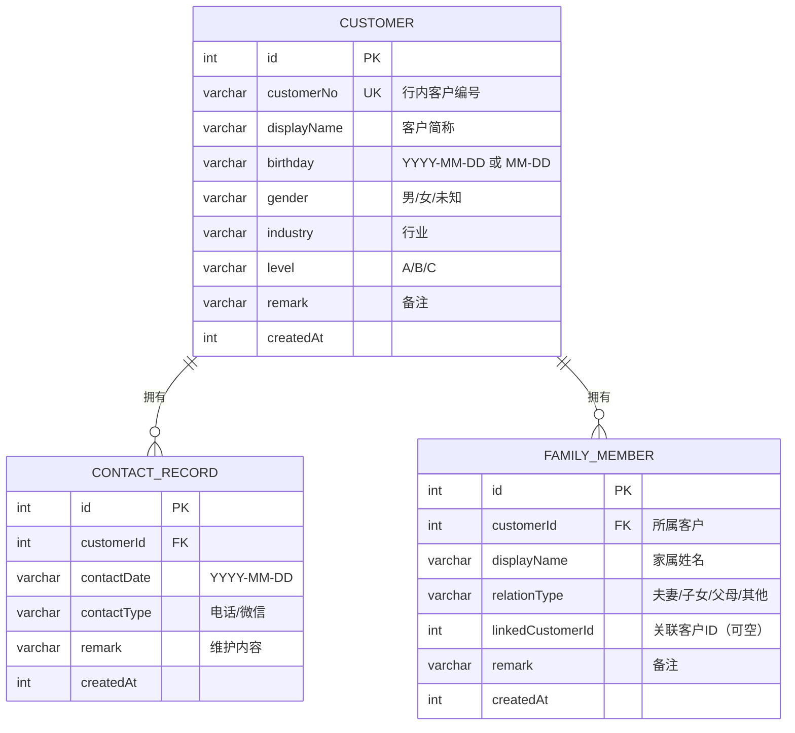

# 心桥（客户生日关怀助手）PRD 产品文档

> 文档用途：供其他智能体平台基于本项目完成复刻（可整篇复制）。
> 文档版本：V2.0（依据当前代码实现整理）｜整理日期：2026-08-05
> 产品名称：心桥｜口号：为你搭建与客户之间心的桥梁
> 在线地址：https://xinqiao.ninkoro.com｜版权标识：Powered by Ninkoro.com

---

## 1. 产品概述

**心桥**是一款面向银行客户经理的轻量化客户关系维护工具。以“客户编号 + 生日提醒 + 祝福辅助 + 维护记录 + 家属关系”为主线，帮助客户经理每天用 30 秒至 2 分钟完成重点客户的生日关怀，避免遗漏、沉淀关系资产。

| 项目 | 内容 |
| --- | --- |
| 产品定位 | 轻量化客户关系维护工具（Web 应用） |
| 目标用户 | 银行客户经理 |
| 一句话介绍 | 一个通过客户编号管理、生日提醒、祝福辅助和维护记录，提升重点客户关系维护效率的工具 |
| 数据边界 | 仅保存客户编号、简称、生日、性别、行业、等级、备注及维护/家属记录；不保存身份证号、银行账号、完整姓名、交易信息 |

---

## 2. 产品背景与目标

### 2.1 背景

- 银行客户经理日常维护客户多，生日关怀属低成本、高情感价值的触达方式；
- 现状依赖 Excel、手机备忘录、人工记忆，存在易遗漏、无法提前规划、缺少维护记录、难以沉淀关系资产等问题。

### 2.2 产品目标

实现“客户信息管理 → 生日自动识别 → 提前提醒 → 生日当天提醒 → 完成维护 → 沉淀维护记录”的完整闭环；个人客户经理可独立使用，零服务器、零成本、隐私友好。

### 2.3 设计原则

1. **极简操作**：每天操作控制在 30 秒～2 分钟，不增加工作量，只减少遗漏；
2. **隐私安全**：仅本地存储，不采集敏感信息；
3. **零成本**：纯前端 + 本地数据库，不依赖商业服务器与收费数据库。

---

## 3. 用户画像与使用场景

- **用户**：银行客户经理（个人使用）。
- **典型场景**：每天上午打开应用 → 查看今日生日与未来 7 天客户 → 电话/微信问候 → 生成祝福语 → 完成维护并记录 → 查看客户详情与家属关系。

---

## 4. 功能架构总览（当前已全部实现）

| 模块 | 子功能 | 状态 |
| --- | --- | --- |
| 首页工作台 | 顶部统计（今日生日 / 未来 7 天 / A 类客户） | 已实现 |
| 首页工作台 | 今日生日卡片（生成祝福 / 完成维护 / 今日已维护标记） | 已实现 |
| 首页工作台 | 未来 7 天生日列表（卡片点击进入客户详情） | 已实现 |
| 客户管理 | 客户列表、搜索（编号/简称）、筛选（等级/时间/行业） | 已实现 |
| 客户管理 | 新增、编辑、删除客户（删除需确认并级联删除维护记录） | 已实现 |
| 客户详情 | 基本信息卡 + 快捷操作（编辑 / 生成祝福 / 完成维护） | 已实现 |
| 客户详情 | 家属关系模块（夫妻/子女/父母/其他，关联已有客户或自由登记） | 已实现 |
| 客户详情 | 历史维护记录模块（按日期倒序，可二次编辑） | 已实现 |
| Excel 导入 | 模板下载、智能生日解析、逐行校验、重复处理、错误报告 | 已实现 |
| Excel 导入 | 导入后撤销（结果页即时撤销 + 设置页撤销上次导入） | 已实现 |
| 数据导出 | 导出客户与维护记录（.xlsx，两个工作表） | 已实现 |
| 生日提醒 | 提前 7 天提醒（卡片可点击进详情） | 已实现 |
| 生日提醒 | 当天提醒（A 类客户 09:00 / 10:00 / 14:00，可标记已联系） | 已实现 |
| 祝福助手 | 离线随机个性化生成（等级 + 行业 + 备注关键词），换一换、复制 | 已实现 |
| 维护记录 | 新增（电话/微信 + 内容，日期自动）、二次编辑 | 已实现 |
| 设置 | 模板下载 / 批量导入 / 数据导出 / 撤销上次导入 | 已实现 |
| 设置 | 清空所有数据（三次确认防误删） | 已实现 |
| 设置 | 提醒开关（本地持久化）、隐私说明、创作者标识 | 已实现 |
| 平台能力 | PWA 离线、安装到桌面/主屏、iOS Safari 添加到主屏幕 | 已实现 |
| 平台能力 | 单文件构建（dist/index.html 可直接双击使用） | 已实现 |

---

## 5. 页面与交互规格

### 5.1 应用外壳

- 整体为移动优先布局：内容区最大宽度 480px 居中，顶部固定标题栏（产品名“心桥”+ 当天日期），底部四个导航项：首页 / 客户 / 提醒 / 设置；
- 全局交互组件：模态弹窗（dialog）、轻提示 Toast、空状态提示；
- 配色：橙白主题（主色橙 #C2410C，浅色背景米白、深色模式自动适配），支持系统深浅色切换。

### 5.2 首页

- 顶部统计三卡：今日生日人数、未来 7 天人数（不含今天）、A 类客户人数；
- “今日生日”卡片：展示客户简称、客户编号、行业、备注；操作按钮“生成祝福”“完成维护”；当天已有维护记录时卡片显示“今日已维护”；
- “未来 7 天生日”列表：按距离天数排序（1～7 天），展示日期、简称、等级徽标、剩余天数；整卡可点击进入客户详情。

### 5.3 客户列表

- 工具栏：新增客户、批量导入；
- 搜索框：按客户编号 / 客户简称实时过滤；
- 筛选：等级（全部/A/B/C）、时间（全部/今日生日/未来 7 天/本月生日）、行业（8 类 + 全部），可组合；
- 行内容：简称 + 等级徽标、编号 · 性别 · 行业、生日月日、距离生日标签、状态（待维护/已完成，由当天维护记录派生）、行操作（查看详情/编辑/删除）。

### 5.4 客户详情页

- 返回按钮 + 客户信息卡（编号、性别、行业、生日、距离生日、备注）+ 快捷操作（编辑客户 / 生成祝福 / 完成维护）；
- **家属关系模块**：关系类型徽标（夫妻/子女/父母/其他）+ 姓名；支持按客户编号/姓名搜索添加关联客户（姓名可点击跳转到对方详情页，并显示“已关联客户”），也可仅登记姓名与备注；支持新增、编辑、删除（删除需确认）；
- **历史维护记录模块**：按日期倒序展示维护日期、方式、内容，每条可二次编辑。

### 5.5 新增 / 编辑客户表单

| 字段 | 必填 | 说明 |
| --- | --- | --- |
| 客户编号 | 是 | 行内唯一，如 C20260001，重复时提示 |
| 客户简称 | 是 | 脱敏名称，如 刘先生 |
| 生日 | 是 | 支持 YYYY-MM-DD 或仅月日 MM-DD（如 08-05） |
| 性别 | 否 | 男 / 女 / 未知 |
| 行业 | 否 | 制造业、建筑业、房地产、批发零售、信息技术、服务业、金融业、其他 |
| 客户等级 | 否 | A 类重点 / B 类重要 / C 类普通 |
| 备注 | 否 | 如“合作5年以上，喜欢茶文化”，可触发祝福个性化 |
| 所属公司 | 否 | 公私联动与客户精准画像，如“华兴制造集团” |
| 职位 | 否 | 如“总经理 / 财务总监” |

### 5.6 提醒页

- “提前 7 天提醒”：列出未来 1～7 天生日客户（受开关控制），卡片可点击进入详情；
- “当天提醒（A 类客户）”：09:00 / 10:00 / 14:00 三个时间点，每行可“标记已联系”（生成维护记录），已有记录显示“已联系”；
- “维护记录”：全部记录按日期倒序，可二次编辑。

### 5.7 设置页

- 数据区：下载 Excel 模板、批量导入、数据导出、撤销上次导入（有导入会话时显示）、清空所有数据；
- 提醒设置：提前 7 天提醒开关、当天提醒开关（localStorage 持久化，key：`birthday-care.settings.v1`）；
- 隐私说明；底部创作者标识“Powered by Ninkoro.com”（纯文本，无链接）。

### 5.8 批量导入流程

1. 下载模板 → 2. 选择 Excel 文件（.xlsx/.xls）→ 3. 系统校验（展示可导入/失败/重复数量与逐行错误）→ 4. 重复客户处理（覆盖 / 跳过 / 取消）→ 5. 导入结果（成功/失败数量 + 下载错误报告）→ 6. 完成。

### 5.9 清空所有数据（三次确认）

步骤：点击“清空数据” → 弹窗第一次确认“清空所有数据？”（按钮：继续）→ 第二次确认“再次确认” → 第三次“最后确认”（红色按钮“确认清空”）→ 执行删除。删除范围：全部客户 + 全部维护记录 + 导入会话；删除不可恢复。

---

## 6. 核心业务规则

### 6.1 生日计算

- 生日字段存储格式统一为 `YYYY-MM-DD` 或 `MM-DD`（无年份）；
- 距离生日天数 = 下一次“月-日”发生日与今天的差值（今天为 0 天）；
- 未来 7 天 = 距离 1～7 天（**不含今天**）；
- 本月生日 = 生日的月段与当前月一致；
- 无年份日期按闰年校验，允许 02-29；带年份日期按真实日历校验（2026-02-30 非法）。

### 6.2 提醒规则

- 提前 7 天：首页“未来 7 天生日”与提醒页同时展示；
- 当天提醒：仅 A 类客户，时间点 09:00 / 10:00 / 14:00（应用内展示，无系统推送）；
- 状态流转：待联系 →（标记已联系）→ 已联系；“已联系/已完成”由该客户当天是否存在维护记录**派生**，避免跨年状态过期。

### 6.3 维护记录

- 字段：客户、日期（自动=当天）、方式（电话/微信）、内容；
- 新增入口：今日生日卡片“完成维护”、提醒页“标记已联系”、客户详情“完成维护”；
- 二次编辑：可修改方式与内容，日期不可改。

### 6.4 家属关系

- 关系类型：夫妻 / 子女 / 父母 / 其他；
- 两种登记方式：搜索并关联系统内已有客户（按编号/姓名搜索，姓名自动取该客户简称，可点击跳转）或仅登记姓名 + 备注；
- **双向自动同步**：关联建立后，被添加客户的详情页自动出现反向从属关系（夫妻↔夫妻、子女↔父母、父母↔子女、其他↔其他），编辑/删除时双方同步更新；
- 增删改均即时生效；删除需确认；应用启动时自动为历史数据补齐反向关系。

### 6.5 生日祝福生成（离线智能 + 随机组合，不调用 AI / 网络）

生成结构（逐层随机选取后拼接）：

1. 称呼句：`{姓名}，生日快乐！` 等 3 种变体；
2. 信任句：按等级选取（A 类 3 种、B 类 2 种、C 类 2 种）；
3. 行业句：8 个行业各有 2 个备选祝愿句（其他行业 2 个通用句）；
4. 备注个性化句：关键词规则匹配（茶、授信、理财、对公/结算、私行、创业、连锁/门店、家族、工程/项目、公益、港澳/跨境、采购、收藏、保险、同业、外贸、民宿、自媒体/主播、写字楼、商会、物业、合作年限提取 `(\d+)年` 等 20 余组）；
5. 结尾句：4 种备选。

约束：
- 总长度 30～80 字；超过 80 时按顺序丢弃“备注句”再“行业句”；
- 禁用词：尊敬的、在这个特殊日子、衷心祝愿；
- “换一换”每次重新随机组合，避免重复；支持一键复制。

### 6.6 Excel 导入校验与撤销

生日智能解析（自动转换并统一存储）：

| 输入格式 | 示例 | 存储结果 |
| --- | --- | --- |
| YYYY-MM-DD | 1990-08-05 | 1990-08-05 |
| MM-DD | 08-05 | 08-05 |
| YYYY/MM/DD | 1990/08/05 | 1990-08-05 |
| YYYY.MM.DD | 1990.08.05 | 1990-08-05 |
| 中文日期 | 1990年8月5日 / 8月5日 | 1990-08-05 / 08-05 |
| 省略补零 | 8-5 / 8/5 / 8.5 | 08-05 |
| 无分隔符 | 19900805 / 0805 | 1990-08-05 / 08-05 |
| Excel 日期对象 / 序列号 | Date 或 45874 | 自动转为日期 |

错误提示（逐行，含行号）：

| 场景 | 提示 |
| --- | --- |
| 客户编号为空 | 客户编号不能为空 |
| 客户简称为空 | 客户简称不能为空 |
| 生日为空 | 生日不能为空 |
| 生日无法识别 | 生日格式无法识别，请填写例如：1990-08-05、08-05、1990年8月5日 |
| 生日不存在（如 2026-02-30） | 生日日期不存在，请检查年月日是否正确 |
| 客户等级非法 | 客户等级格式错误，请填写 A/B/C |

重复处理：按客户编号判断，提供“覆盖（更新原记录）/ 跳过 / 取消”。

撤销导入：记录本次新增客户 ID 列表 + 被覆盖客户的修改前快照；撤销时删除新增客户及其维护记录、还原被覆盖客户数据。

### 6.7 数据导出

导出 .xlsx，含“客户”与“维护记录”两个工作表，列与导入模板一致。

---

## 7. 数据模型

数据库：浏览器 IndexedDB（Dexie.js 封装），库名 `birthday-care-assistant`，当前 schema 版本 2（升级不丢数据）。

### 7.1 实体关系



### 7.2 表结构与索引

| 表 | 字段 | 索引 |
| --- | --- | --- |
| customers | id, customerNo, displayName, birthday, gender, industry, level, remark, company?, position?, createdAt | ++id, customerNo, birthday, level, industry |
| records | id, customerId, contactDate, contactType, remark, createdAt | ++id, customerId, contactDate |
| familyMembers | id, customerId, displayName, relationType, linkedCustomerId, remark, createdAt | ++id, customerId, linkedCustomerId |

### 7.3 派生状态

- 客户“待维护/已完成”、提醒“待联系/已联系”：由该客户当天是否存在维护记录（contactDate = 今天）派生，不落库，避免跨年过期。

---

## 8. 隐私与安全

- 仅保存：客户编号、简称、生日、性别、行业、等级、备注、维护记录、家属关系；
- 不保存：身份证号码、银行账号、完整客户姓名、交易信息；
- 无后端、无埋点、无网络请求（静态资源除外），数据仅存本机浏览器 IndexedDB；
- 设置项存 localStorage；提供数据导出用于备份；清空数据需三次确认。

---

## 9. 技术方案

### 9.1 技术栈

| 层 | 选型 |
| --- | --- |
| 前端框架 | React 19 + TypeScript + Vite 6 |
| 状态/数据 | Dexie.js 4（IndexedDB）+ dexie-react-hooks（响应式查询） |
| Excel | SheetJS xlsx 0.20.3（浏览器内解析/导出，文件不上传） |
| 图标 | lucide-react |
| PWA | vite-plugin-pwa（Workbox generateSW）+ vite-plugin-singlefile |
| 测试 | Vitest（单元测试 18 例）+ Playwright（浏览器冒烟，覆盖全流程/PWA 离线/单文件模式） |

### 9.2 构建与运行

```bash
npm install
npm run dev          # 开发
npm test             # 单元测试
npm run build        # 构建（单文件 dist/index.html + PWA 资源）
npm run preview      # 本地预览
npm run smoke        # 浏览器冒烟（自动走查并截图）
npm run demo-data    # 重新生成 48 位客户演示数据
npm run icons        # 重新生成 PWA 图标
```

### 9.3 部署

- 个人网站：https://xinqiao.ninkoro.com；
- 通用静态托管：Vercel / GitHub Pages（已配置 `base: './'`，子路径可用）；
- 本地：构建后直接双击 `dist/index.html`（单文件自包含，无需服务器）。

### 9.4 PWA / 离线

- Service Worker 预缓存 index.html 与图标，导航回退 index.html；
- 仅 http/https 环境注册 SW（file:// 不注册），离线与安装能力在 HTTPS 或 localhost 生效；
- iOS Safari：通过“分享 → 添加到主屏幕”生成网页 App（无系统级推送，需打开应用查看提醒）。

---

## 10. 非功能需求

| 项 | 要求 |
| --- | --- |
| 性能 | 数千客户量级全量查询 + 内存计算无压力；首屏无阻塞大计算 |
| 兼容 | Chrome / Edge 现代版本；iOS Safari 添加到主屏幕可用 |
| 主题 | 浅色/深色自动适配（CSS light-dark） |
| 可访问性 | 原生语义控件、键盘可操作、弹窗可关闭、图片含替代文本 |
| 数据安全 | 本地优先、可导出备份、误操作可撤销（导入）或三次确认（清空） |

---

## 11. 验收标准

客户经理可以：

1. 下载 Excel 模板并批量导入客户（含多种生日格式自动识别）；
2. 查看今日生日与未来 7 天客户，提前安排关怀；
3. 收到提前 7 天提醒，并可从提醒卡片进入客户详情；
4. 对当天 A 类客户按 09:00/10:00/14:00 完成联系与记录；
5. 获取 30-80 字个性化生日祝福（行业 + 备注关键词，离线随机）；
6. 记录并二次编辑维护记录，查看客户历史维护记录；
7. 登记客户家属关系并跳转关联客户；
8. 误导入时一键撤销；定期导出备份；必要时三次确认后清空数据；
9. 断网可用、可安装到桌面/主屏（含 iOS Safari 添加主屏幕）；
10. 隐私合规：全程本地存储，不采集敏感信息。

---

## 12. 已实现 vs 后续规划

### 12.1 已实现（当前版本）

见第 4 节功能架构总览（全部功能已实现并通过测试）。

### 12.2 暂未开发（P2，供后续规划）

- AI 自动生成祝福（当前为本地模板随机组合）；
- 多用户协作 / 云同步；
- CRM 分析与报表；
- 银行系统接口对接；
- 系统级推送通知（含 iOS 推送）；
- 客户批量删除、跨年生日提醒策略配置等高级设置。

---

## 13. 复刻实施指南（供其他智能体平台）

### 13.1 建议里程碑

| 里程碑 | 内容 | 依赖 |
| --- | --- | --- |
| M0 工程骨架 | Vite + React + TS、四页底部导航、主题、IndexedDB 建表（3 张） | 无 |
| M1 客户管理 | 新增/编辑/删除/搜索/筛选、客户列表、Excel 模板/导入（智能生日解析、校验、重复处理、撤销）/导出 | M0 |
| M2 生日提醒 | 生日计算工具、首页统计与今日卡片、未来 7 天列表、提醒页（提前 7 天 + 当天 A 类三次）、完成维护状态流转 | M0 |
| M3 详情与扩展 | 客户详情页（历史维护记录 + 家属关系 + 记录编辑）、祝福助手（离线随机生成） | M1、M2 |
| M4 设置与平台化 | 清空数据三次确认、提醒开关、PWA 离线、单文件构建、隐私说明 | M1~M3 |
| M5 质量保障 | 单元测试（日期/祝福/导入）、浏览器冒烟（含 PWA 离线与 file:// 模式）、演示数据 | M0~M4 |

### 13.2 关键实现要点（复刻时易踩坑）

1. **未来 7 天不含今天**：距离 1～7 天，今日单独统计；
2. **生日支持仅月日**：存储 `MM-DD`，按“下一次月日”计算，不做年龄计算；
3. **导入兼容**：生日智能解析多种格式并校验真实日期（2026-02-30 必须报错）；
4. **状态派生**：待维护/已联系由“当天是否有维护记录”派生，不要落库状态，避免跨年过期；
5. **撤销导入**：记录新增 ID 与覆盖前快照，撤销时级联删除维护记录；
6. **清空数据**：三次确认，删除客户与维护记录并清空导入会话；
7. **单文件构建 + PWA**：vite-plugin-singlefile 内联 JS/CSS 使 `dist/index.html` 可双击使用；SW 仅在 http/https 注册，预缓存仅 html+图标（避免与单文件删除资源冲突）；
8. **祝福生成**：纯本地规则引擎，随机组合并校验 30-80 字、过滤禁用词；
9. **隐私**：无后端、无埋点；敏感字段不入库。

### 13.3 演示数据

`demo/客户生日关怀助手_产品展示数据.xlsx`：48 位客户，覆盖今日生日（8 月 5 日 4 位）、未来 7 天（7 位）、全行业全等级、多种生日格式（含 Excel 日期序列号）、备注关键词（茶/合作/授信等），可一键导入演示完整功能。

---

> 心桥 · 为你搭建与客户之间心的桥梁
> Powered by Ninkoro.com
